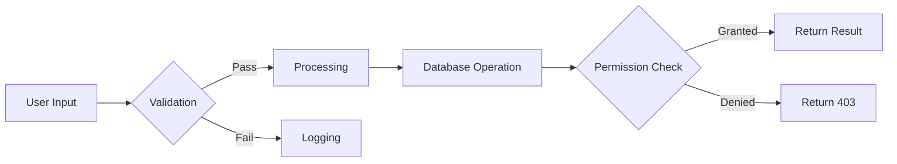
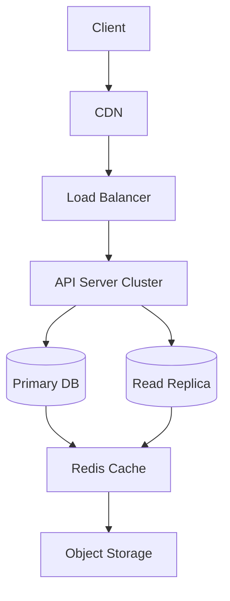

# Advanced Features Guide

+++ New Content
- Enhanced math formulas
- Complex diagram examples
- Multi-language code samples
- Security considerations
+++

## Mathematical Formulas

Matrix Operations:
$$
\begin{bmatrix}
1 & 2 \\
3 & 4 \\
\end{bmatrix}
\begin{bmatrix}
x \\
y \\
\end{bmatrix}
=
\begin{bmatrix}
5 \\
11 \\
\end{bmatrix}
$$

Calculus Example:
$$
\int_{0}^{\infty} e^{-x^2} dx = \frac{\sqrt{\pi}}{2}
$$

## Multi-language Examples

### Go Concurrency Pattern
```go
package main

import (
    "fmt"
    "sync"
)

func main() {
    var wg sync.WaitGroup
    ch := make(chan int, 3)

    for i := 0; i < 5; i++ {
        wg.Add(1)
        go func(n int) {
            defer wg.Done()
            ch <- n * n
        }(i)
    }

    go func() {
        wg.Wait()
        close(ch)
    }()

    for result := range ch {
        fmt.Println(result)
    }
}
```

### Rust Pattern Matching
```rust
enum Message {
    Quit,
    Move { x: i32, y: i32 },
    Write(String),
}

fn handle_message(msg: Message) -> String {
    match msg {
        Message::Quit => String::from("Quit program"),
        Message::Move { x, y } => format!("Move to ({}, {})", x, y),
        Message::Write(text) => format!("Message: {}", text),
    }
}
```

## Security Specifications



## Performance Strategies

1. **Caching Strategy**:
```javascript
// Cached API calls
async function cachedFetch(url, options = {}) {
  const cacheKey = generateKey(url, options);
  const cached = await cacheStore.get(cacheKey);
  
  if (cached && !isExpired(cached)) {
    return cached.data;
  }

  const freshData = await fetch(url, options);
  await cacheStore.set(cacheKey, freshData, { ttl: 3600 });
  return freshData;
}
```

2. **Database Index Optimization**:
```sql
-- Composite index example
CREATE INDEX idx_users_active ON users (status, last_login_date) 
WHERE status = 'active';
```

## Deployment Architecture

